# Automad Prism Themes

A modern collection of syntax highlighting themes for [Prism](https://prismjs.com).

> [!NOTE]
> This is a fork of the [PrismJS/prism-themes](https://github.com/PrismJS/prism-themes) repository. All included themes are optimized to work with Automad. New themes have been added, some have been removed.

---

<!-- vim-markdown-toc GFM -->

- [Themes](#themes)
- [How to use a Theme](#how-to-use-a-theme)
- [Customizing](#customizing)

<!-- vim-markdown-toc -->

## Themes

The following themes are included. Some of them have been ported over to Prism from VS Code. You can find more information about the theme authors and source repositpries in the file headers inside the [themes](themes) directory.

<!-- gallery-start -->

|                                   <br>[Atom Dark](themes/prism-atom-dark.css)                                   |                             <br>[Aura Dark](themes/prism-aura-dark.css)                             |                   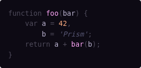<br>[Boola Dark](themes/prism-boola-dark.css)                   |
| :----------------------------------------------------------------------------------------------------------------------------------------------------------: | :----------------------------------------------------------------------------------------------------------------------------------------------: | :------------------------------------------------------------------------------------------------------------------------------: |
|                               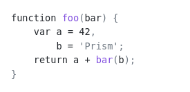<br>[Boola Light](themes/prism-boola-light.css)                               |             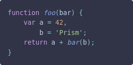<br>[Catppuccin Frappe](themes/prism-catppuccin-frappe.css)             |       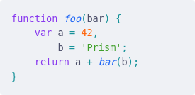<br>[Catppuccin Latte](themes/prism-catppuccin-latte.css)       |
|             <br>[Catppuccin Macchiato](themes/prism-catppuccin-macchiato.css)             |               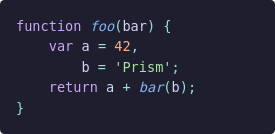<br>[Catppuccin Mocha](themes/prism-catppuccin-mocha.css)               |               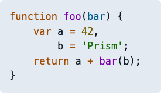<br>[Coldark Cold](themes/prism-coldark-cold.css)               |
|                             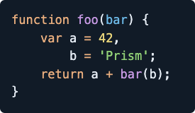<br>[Coldark Dark](themes/prism-coldark-dark.css)                             |                           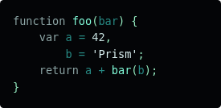<br>[Dark Frost](themes/prism-dark-frost.css)                           |                   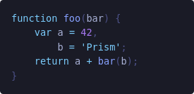<br>[Dark Space](themes/prism-dark-space.css)                   |
|                                       <br>[Dracula](themes/prism-dracula.css)                                       |                       <br>[Duotone Dark](themes/prism-duotone-dark.css)                       |             <br>[Duotone Earth](themes/prism-duotone-earth.css)             |
|                         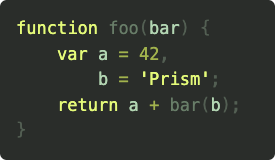<br>[Duotone Forest](themes/prism-duotone-forest.css)                         |                     <br>[Duotone Light](themes/prism-duotone-light.css)                     |                 <br>[Duotone Sea](themes/prism-duotone-sea.css)                 |
|                           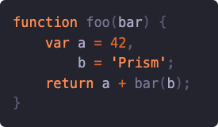<br>[Duotone Space](themes/prism-duotone-space.css)                           |                         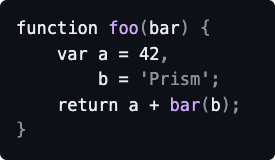<br>[Github Dark](themes/prism-github-dark.css)                         |               <br>[Github Light](themes/prism-github-light.css)               |
|                             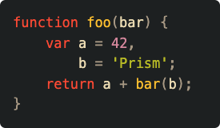<br>[Gruvbox Dark](themes/prism-gruvbox-dark.css)                             |                     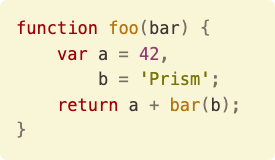<br>[Gruvbox Light](themes/prism-gruvbox-light.css)                     |                   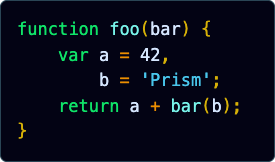<br>[Holi Theme](themes/prism-holi-theme.css)                   |
|                                   <br>[Hopscotch](themes/prism-hopscotch.css)                                   |                             <br>[Laserwave](themes/prism-laserwave.css)                             |                         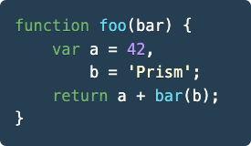<br>[Lucario](themes/prism-lucario.css)                         |
|                           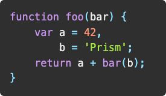<br>[Material Dark](themes/prism-material-dark.css)                           |                   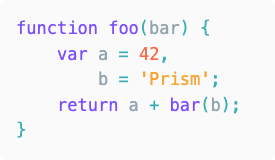<br>[Material Light](themes/prism-material-light.css)                   |       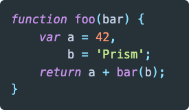<br>[Material Oceanic](themes/prism-material-oceanic.css)       |
|   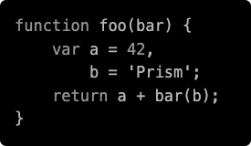<br>[Monochrome Dark Amplified](themes/prism-monochrome-dark-amplified.css)   |   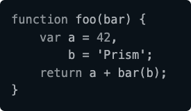<br>[Monochrome Dark Subtle](themes/prism-monochrome-dark-subtle.css)   |         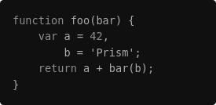<br>[Monochrome Dark](themes/prism-monochrome-dark.css)         |
| 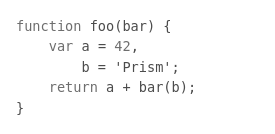<br>[Monochrome Light Amplified](themes/prism-monochrome-light-amplified.css) | 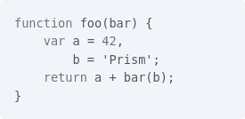<br>[Monochrome Light Subtle](themes/prism-monochrome-light-subtle.css) |       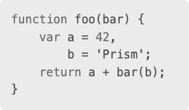<br>[Monochrome Light](themes/prism-monochrome-light.css)       |
|                                   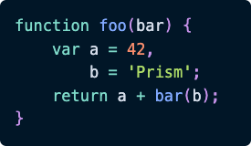<br>[Night Owl](themes/prism-night-owl.css)                                   |                                       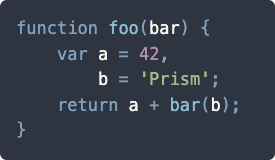<br>[Nord](themes/prism-nord.css)                                       |                       <br>[One Dark](themes/prism-one-dark.css)                       |
|                                   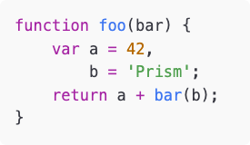<br>[One Light](themes/prism-one-light.css)                                   |                                     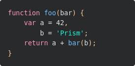<br>[Panda](themes/prism-panda.css)                                     |                   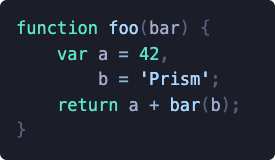<br>[Poimandres](themes/prism-poimandres.css)                   |
|                                     <br>[Pojoaque](themes/prism-pojoaque.css)                                     |                   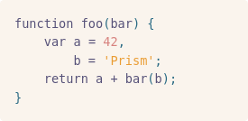<br>[Rose Pine Dawn](themes/prism-rose-pine-dawn.css)                   |                     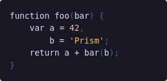<br>[Rose Pine](themes/prism-rose-pine.css)                     |
|                       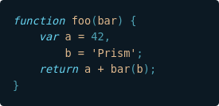<br>[Sea Shells Dark](themes/prism-sea-shells-dark.css)                       |               <br>[Shades Of Purple](themes/prism-shades-of-purple.css)               | <br>[Solarized Dark Atom](themes/prism-solarized-dark-atom.css) |
|                               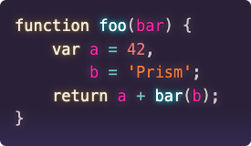<br>[Synthwave84](themes/prism-synthwave84.css)                               |             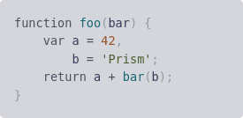<br>[Tokyo Night Light](themes/prism-tokyo-night-light.css)             |     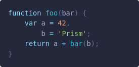<br>[Tokyo Night Storm](themes/prism-tokyo-night-storm.css)     |
|                               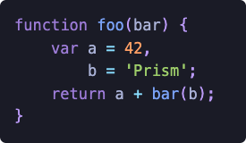<br>[Tokyo Night](themes/prism-tokyo-night.css)                               |                       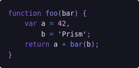<br>[Violet Dream](themes/prism-violet-dream.css)                       |             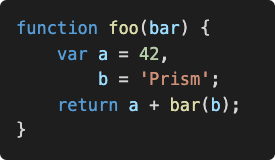<br>[Vsc Dark Plus](themes/prism-vsc-dark-plus.css)             |

<!-- gallery-end -->

## How to use a Theme

To use one of the themes, just include the theme's CSS file in your page. Example:

```html
<!doctype html>
<html>
  <head>
    ...
    <link
      href="https://unpkg.com/automad-prism-themes/dist/prism-tokyo-night.css"
      rel="stylesheet"
    />
  </head>
  <body>
    ...
    <script src="https://unpkg.com/prismjs@1.29.0/components/prism-core.min.js"></script>
    <script src="https://unpkg.com/prismjs@1.29.0/plugins/autoloader/prism-autoloader.min.js"></script>
  </body>
</html>
```

## Customizing

Some basic theme settings are exposed using CSS custom properties. These properties can be defined for better integration into a site's theme.

```css
:root {
  --am-prism-padding: 1rem;
  --am-prism-border-radius: 0.3em;
  --am-prism-font-size: 0.875rem;
  --am-prism-font-family: ui-monospace;
  --am-prism-line-height: 1.5;
}
```
